# BATC EFB

**BeyondATC on the MSFS 2024 tablet.**

An app for the native EFB (Electronic Flight Bag) of Microsoft Flight Simulator 2024 that brings
BeyondATC into the cockpit. You can talk to ATC, read the radio conversation, tune frequencies and
change the BeyondATC settings on the in-sim tablet, in the 2D window or in the 3D cockpit.

It is the EFB edition of [BATC Remote](https://github.com/Proxi64/BATC-Remote) (the Android remote
for BeyondATC), redesigned for the size of the tablet.

<p align="center">
  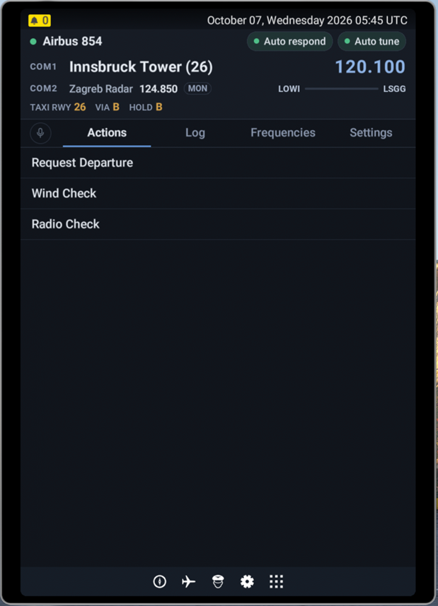
  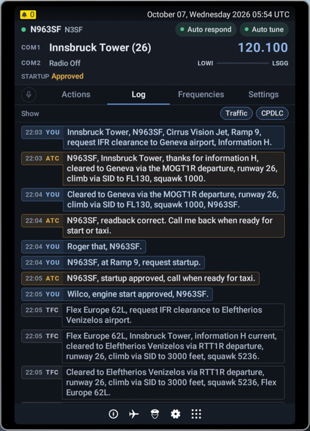
  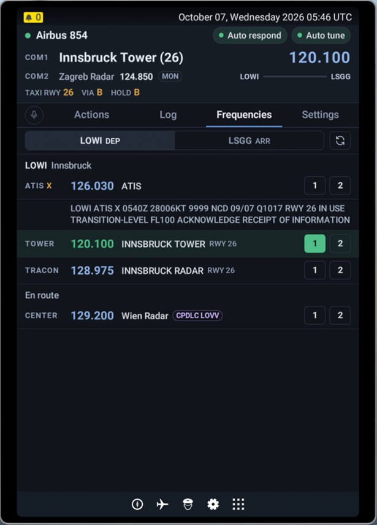
  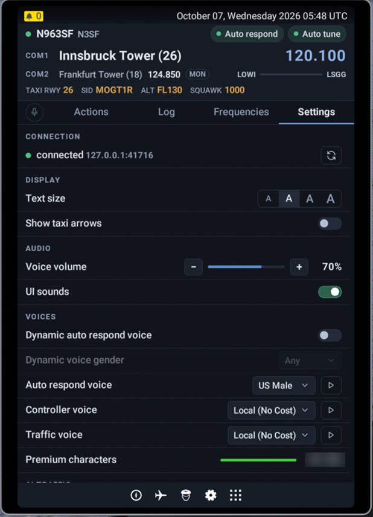
</p>

> [!IMPORTANT]
> **BATC EFB is an independent community tool.** It is **unsupported** and is **not an official BeyondATC tool**.
> Please **do not contact BeyondATC support** about it. Use this repository's Issues instead.
> BeyondATC and Microsoft Flight Simulator are trademarks of their respective owners.

## Features

### Header, on every page

- Callsign and its short form, with the **Auto respond** and **Auto tune** co-pilot switches.
- **COM1**: station and frequency. **COM2**: station, frequency and `MON` when it is monitored.
  A muted radio is shown as *Muted*.
- Flight progress bar between the departure and arrival airports.
- The current clearance on one line, with short labels: `TAXI RWY 26  VIA B  HOLD B`,
  `SID MOGT1R  ALT FL130  SQUAWK 1000`…

### Radio light

A light on the left of the tabs shows the state of the radio exchange:

| Light | Meaning |
| --- | --- |
| Off | Radio idle |
| Blue | A request was just sent from the tablet |
| Amber, blinking | Request queued, being processed or awaiting a response |
| Green | ATC or the co-pilot is transmitting |
| Grey, blinking | Another aircraft is talking on the frequency |

### Actions

The ATC requests offered by BeyondATC, as a list that fits on the tablet. Short answers
(Affirm, Negative, flight levels…) are shown four per line.

### Log

The radio conversation as a transcript. Each message sits in a thin frame coloured by speaker
(ATC amber, you blue, traffic grey, CPDLC violet), with the time and the speaker in a tab on its
left side (`21:00 ATC`). **Traffic** and **CPDLC** filters, and a *New messages* button when you
have scrolled up.

### Frequencies

- Departure and arrival airports, en route centers and VFR services, as a table, refreshed each time
  the tab is opened (and with the refresh button).
- **1** / **2** buttons on every line to tune COM1 or COM2 in one tap. The tuned station is highlighted.
- D-ATIS: the ATIS letter, and the full text when you tap it.
- CPDLC logon code of the centers that have one.

### Settings

- **Connection**: state of the link with BeyondATC and a reconnect button.
- **Display**: text size (4 steps), taxi arrows.
- **Audio**: voice volume, UI sounds.
- **Voices**: dynamic auto respond voice and its gender; auto respond voice, controller voice and
  traffic voice, each with a *Play* sample button; premium characters left.
- **AI traffic**: on/off, parked, departures, arrivals and en route densities, Navigraph live traffic.
- **Flight**: quit to the BeyondATC main menu.
- **About**: app version, BeyondATC protocol version, unrecognised messages and the EFB layout
  measured by the app (for troubleshooting).

### Other screens

- BeyondATC's *Start a flight* menu (IFR from a SimBrief plan, VFR from SimBrief or the MSFS world map)
  and the loading screens.
- BeyondATC questions (Yes/No), warnings and errors.
- When BeyondATC cannot be reached: what is happening, the next retry, a short checklist and a
  *Retry now* button. The app reconnects by itself.

<details>
<summary><b>All screenshots, 2D window and 3D cockpit</b></summary>

| | 2D window | 3D cockpit |
| --- | --- | --- |
| BATC EFB in the EFB apps | 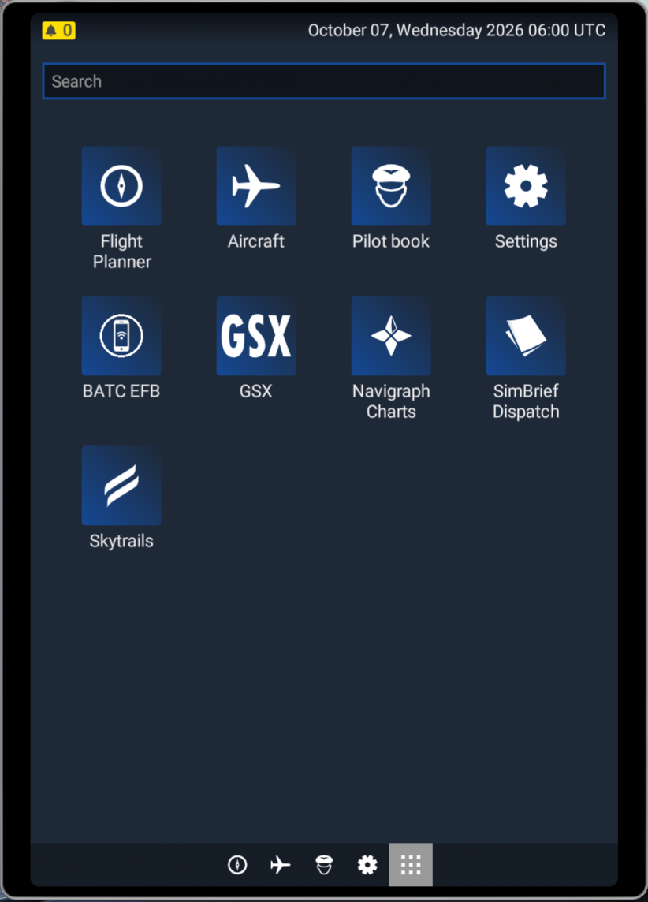 | 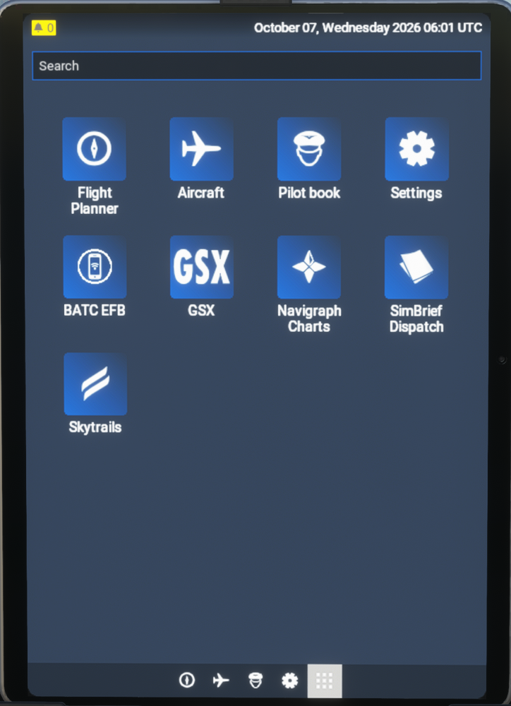 |
| Actions |  | 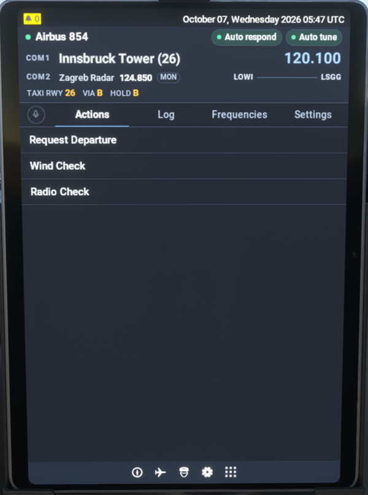 |
| Log |  | 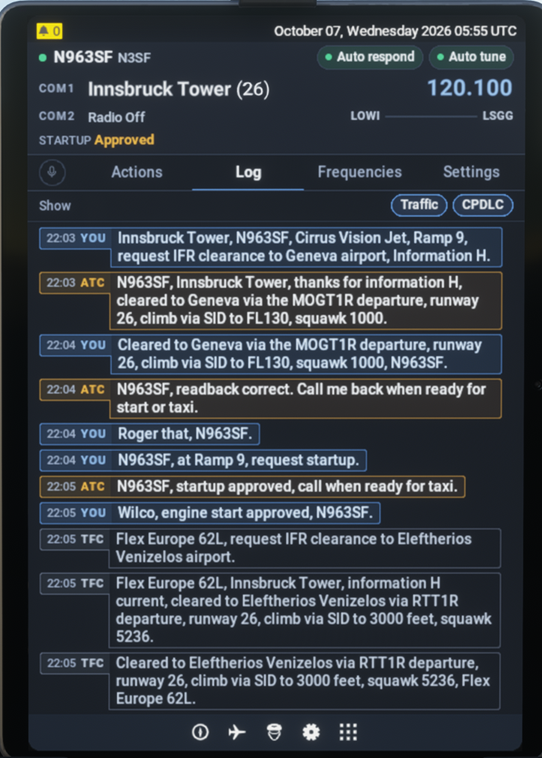 |
| Frequencies |  | 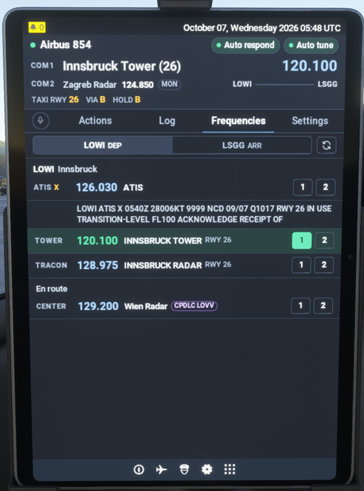 |
| Settings |  | 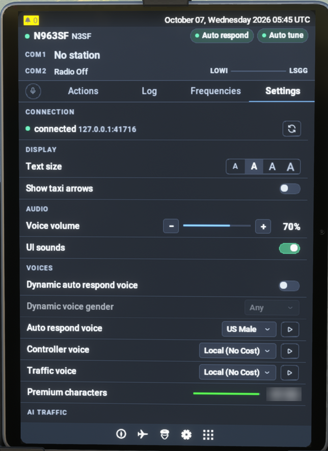 |
| Settings (continued) | 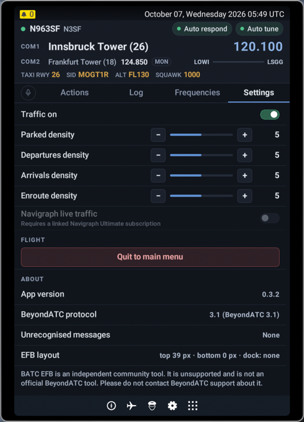 | 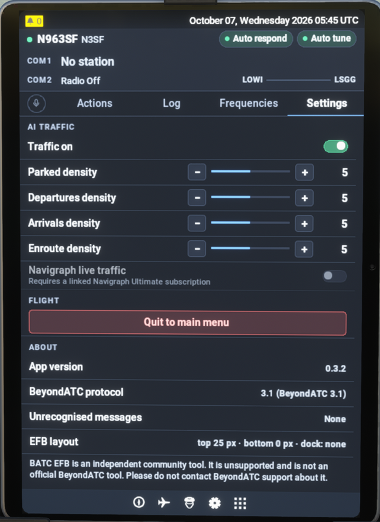 |

</details>

## Requirements

- Microsoft Flight Simulator 2024, with an aircraft that has the EFB tablet.
- BeyondATC running on the same PC. The app connects to it locally on `ws://127.0.0.1:41716`;
  no other program is needed.

## Install

1. Get the package, `batc-efb-X.Y.Z.zip`, and extract it.
2. Copy the `batc-efb` folder into your MSFS 2024 **Community** folder.
3. Start MSFS and a flight, open the EFB tablet and tap **BATC EFB** in the apps.

**To update**, delete the old `batc-efb` folder from the Community folder before copying the new one,
then restart MSFS: the simulator only reads the packages when it starts.

## Troubleshooting

- **"BeyondATC unreachable"**: check that BeyondATC is running on this PC and is up to date
  (it must accept local connections on port 41716). The app retries by itself, or tap *Retry now*.
- **BATC EFB is not in the EFB apps**: check that the folder is named `batc-efb` and contains
  `manifest.json` and `layout.json` directly (not in a sub-folder), then restart MSFS.
- **Text too small or too large**: Settings > Display > Text size.

## How it works

```
EFB tablet ── BATC EFB app (shell) ── <iframe> web app ── WebSocket ws://127.0.0.1:41716 ── BeyondATC
```

- **The shell** (`app/src/shell/`) is a small EFB app written with the official
  [`@microsoft/msfs-efb-api`](https://www.npmjs.com/package/@microsoft/msfs-efb-api) and
  [`@microsoft/msfs-sdk`](https://www.npmjs.com/package/@microsoft/msfs-sdk) packages.
  It finds the EFB status bar and dock, places the web app between them, and shows a waiting
  screen (with the error, if any) until the web app has started.
- **The web app** (`app/src/web/`) is written with Preact and loaded from the package.
  It talks to BeyondATC with the same protocol as the BeyondATC toolbar (version 3.1),
  reconnects by itself and keeps the state of the flight in a store.
- **Built for the simulator's HTML engine**: the stylesheet only uses what it supports (flexbox,
  no CSS grid), every size follows the width of the tablet so the app looks the same in 2D and 3D,
  and the app ships its own Roboto fonts. A test checks that every text only uses characters
  these fonts contain; arrows and triangles are drawn as icons.

| Folder | Content |
| --- | --- |
| `app/src/shell/` | EFB app: frame, waiting screen, placement between the status bar and the dock (`layout.ts`) |
| `app/src/web/protocol/` | BeyondATC protocol: message parser and commands |
| `app/src/web/core/` | Connection with reconnection, state store, controller, clearance and radio-light logic |
| `app/src/web/ui/` | Header, tabs and panels (Actions, Log, Frequencies, Settings), screens and dialogs |
| `app/src/web/fonts/` | Roboto Medium and Bold (Apache License 2.0, see `LICENSE-Roboto.txt`) |
| `app/tests/` | Unit tests (parser, store, connection, header and radio-light logic, font coverage) |
| `app/tests/fixtures/` | A recorded BeyondATC session, used by the tests and the simulator |
| `app/dev/batc-simulator.mjs` | BeyondATC simulator, to work without MSFS |
| `tools/build-layout.mjs` | Generates `package/layout.json` and the package size in `manifest.json` |
| `tools/strip-svg-metadata.mjs` | Removes the `<metadata>` block (C2PA manifest) from SVG files; also used by the build |
| `package/` | The Community package (`manifest.json`; the rest is generated by the build) |
| `Images/` | Screenshots used in this README |

## Build

Requires [Node.js](https://nodejs.org/) 20 or later.

```bash
cd app
npm install
npm test        # unit tests
npm run build   # typecheck + bundle + layout.json
```

The package is then ready in `package/`: copy it into the Community folder under the name `batc-efb`.

To work on the web app without MSFS, run `npm run sim` (a BeyondATC simulator on port 41716 that
replays the recorded session) and open `package/html_ui/efb_ui/efb_apps/BatcEfb/web/index.html`
through any local web server. `npm run watch` rebuilds the app on every change.

## Versions

See the [CHANGELOG](CHANGELOG.md). The version is set in `app/package.json` and in
`package_version` of `package/manifest.json`, whose release notes appear in the simulator.

## License

[MIT](LICENSE) © Proxi64. Roboto font: Apache License 2.0.
